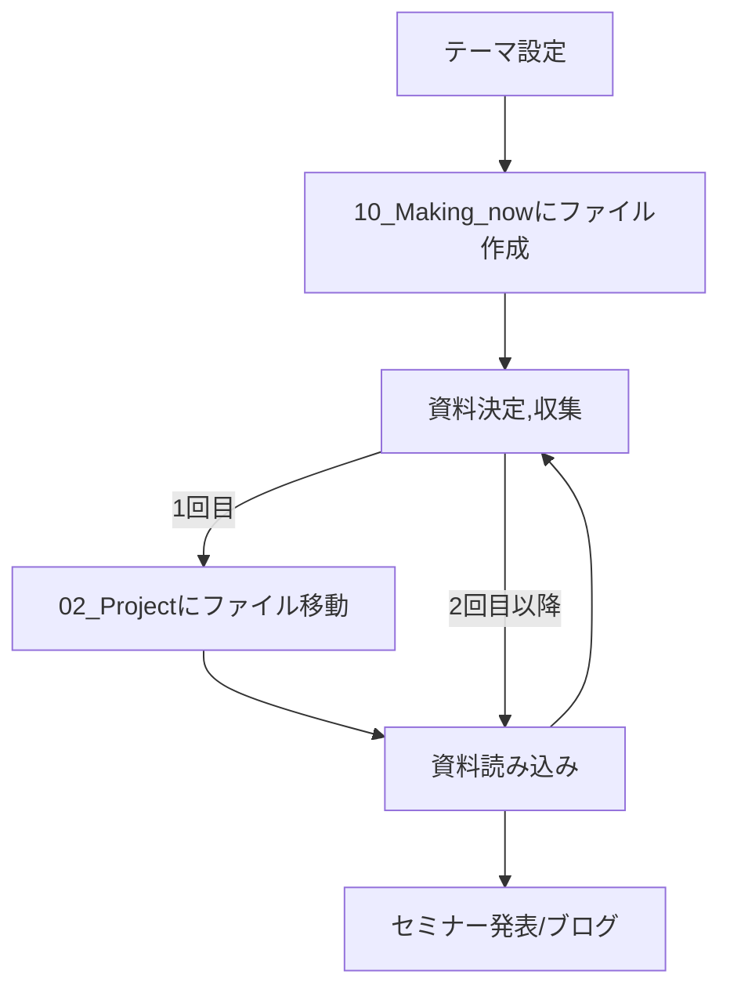

作成日時: 2024-05-31 00:44 
最終更新日時:2024-05-31 00:44
###### **目次**
```toc
style:nestedList
minLevel:2
maxLevel:5
```
# プロジェクト進行方向
## 流れ

テーマ設定してから完了、記録までの流れ。

大まかな流れとしては


### テーマ設定

取り扱う題材、目的を設定する。

とりあえず思いついたら10_Making_nowにファイルを作成。名前だけの空ファイルでいい。

なるべく具体的な到達目標を設定する。

### 資料決定,収集

必要な資料を集める。目安として書籍15-20冊。
テーマによって論文、webページも含める。これらが多ければ書籍は少なくても可。

[Developer Roadmaps](https://roadmap.sh/roadmaps)

↑も参考に。

書籍の入手の方法として購入、図書館を考える。資料を大まかに3段階にレベル分けする。
1:入門,基礎,2:応用,3:発展

そこまでいってやる気の準備と心構えができたらファイルを02_Projectに移動させる。

### 資料読み込み

集めた資料をとにかく読む。段階ごとに読んでいく。

[本の読み方]()、[論文の読み方]()も参考に。

資料を読んだ上でより必要な資料を追加、さらに読み込みを加速させる。

### セミナー発表/ブログ

アウトプットする。複数の媒体で行うとより良い。

ブログはとりあえず一番簡単なのでかならずするようにしたい。
テーマによっては同人誌/zennの本を作成すると良い。

## 大型プロジェクト

かなり大きい、期間がかかるようなものを指す。

目次となるページを作成し部分ごとにプロジェクトページを作成する。全般で参照するものと特定の部分で参照するもので分ける。