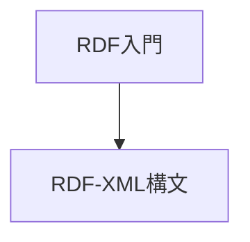

## ロードマップ

- [RDF入門](https://www.asahi-net.or.jp/~ax2s-kmtn/internet/rdf/rdf-primer.html)
- [RDF 1.1 XML構文](https://www.asahi-net.or.jp/~ax2s-kmtn/internet/rdf/REC-rdf-syntax-grammar-20140225.html)

## 単語まとめ

- URI(Rniform Resorce Identifier) : ウェブ識別子。一意に識別できる。特定の形式ではなく、一意に識別できる識別子を指す。
- ノード : グラフ形式での点
- アーク ： グラフ形式での線、矢印
- RDFグラフ ： RDFを表したグラフ
- プロパティー(property) : ある事物、概念の性質
- URIフラグメント ： URIの最後の部分で、#から始まる部分。 リソースの特定部分を指す。
- URIref : URIにURIフラグメントを足したもの。これ自体もURIである。
- トリプル： 主語・述語・目的語の3つが、この順序で構成するもの。主に、ステートメントやグラフ形式で表される。
- RDFステートメント：一つのRDFトリプレットの文、組。例`<http://www.example.org/index.html> <http://purl.org/dc/elements/1.1/creator> <http://www.example.org/staffid/85740> .`
- 空白ノード ： 中間に付け足しただけのノードで、意味を持たない。構造のためだけに必要。
- 型付リテラル ： ただのリテラルだけでは、それの単位や意味するところの制限がなく、文脈依存になるので、型としてURIlefを関連付けたもの
- 空要素タグ : XML中で、別個の終了タグを持たないもの
- QName : 接頭辞+ローカル名で表される。省略名。属性値には使うことができない。

## RDFモデル

主語・述語・目的語の三組(トリプレット)で表現する形式。グラフ形式であり、データの形式としてはXMLなどが使われる。

主語・目的語はグラフにおけるノードになり、述語はグラフにおける、アーク(矢印)になる。

### 型付リテラル

一般的なプログラミングにおける、データ型のようなものはない。しかしそれだと27が年齢なのか、十進数なのか、8進数なのかがわからず困るので、型付リテラルを用いる。データ型のようにURIlefを使う。

ただし、型付リテラルそれ自体は、データ型と異なり、リテラルの制限を行わない。例えば、`text`という文字列にたいして`xsd:integer`をつけて型付リテラルにすることは、可能である。しかし`xsd:integer`は整数を表すので正しくない。
そのため、この部分は実装するソフトウェア側での制限が別に必要になる。

データの整合性や、意味の確定のためにもプレーンリテラルではなく、型付リテラルを用いることが望ましい。

## XML

プレーンリテラルと、別の資源を持つURIの区別は、タグの形式で行う。

プレーンリテラルは以下のように、開始タグと終了タグを持つ。

`<dc:language>en</dc:language>`

それに対して、URIrefであれば空要素タグを用いて、終了タグを別個にもたせない。そして、`rdf:resource`を用いる。この際に、QNameで省略は不可能。これは、属性値であるため。

`<dc:creator rdf:resource="http://www.example.org/staffid/85740"/>`

## 参考

1. [RDF入門](https://www.asahi-net.or.jp/~ax2s-kmtn/internet/rdf/rdf-primer.html)
2. [URI フラグメント - URI \| MDN](https://developer.mozilla.org/ja/docs/Web/URI/Reference/Fragment)
3. [マーメイド#5 フローチャート② #mermaid - Qiita](https://qiita.com/hirokiwa/items/6c1c29b79897c9911718)
