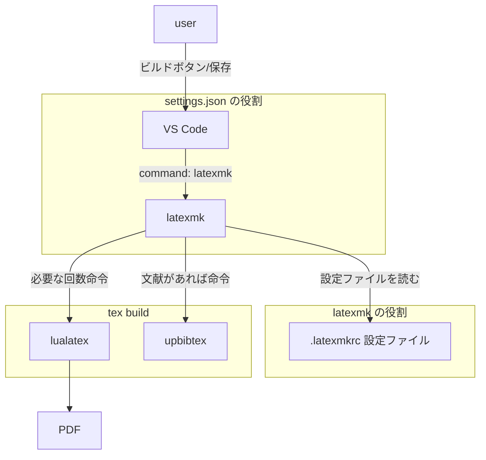

## 環境作成

編集にはVSCodeを使う想定。

全体の構成図



latexmk は$\LaTeX$のビルドを管理するためツール。`.latexmkrc`を`~/`に作成すると設定ファイルとして読み込む。正しく読み込めているかは

```bash
latexmk
```

で

```bash
Rc files read:
  /home/saku/.latexmkrc
Latexmk: This is Latexmk, John Collins, 15 June 2025. Version 4.87.
```

↑のようにファイル名が表示されればok

### どれいれるか

LaTeXと一言でいっても色々種類がある。

そもそもの$\TeX$と$\LaTeX$の違いとして$\TeX$が組版システムでそのマクロ郡がLaTeXである(雑に言えば)。そしてLaTeX自体にも様々な種類がある。一応$\LaTeX$以外にもマクロ郡はある。$\LaTeX$のなかから選ぶとおおよそ同じような書き方ができる。ただし日本語対応などで違いある。

主なLaTexとしてはpLaTeX、upLaTeXなどがある。色々見るところlualatexが良さそう。

それらのLaTeXエンジンとその他のフォントやツールをまとめたディストリビューションとしてTeX Liveがあり基本はこれを使う。設定ファイル(`.latexmkrc`)の書き方によって実際に使用するLaTeXエンジンは切り替えられる。lualatexに設定する。

TeX Liveで基本いいがデメリットとして他の数倍のデータ量であることと思ったよりもインストールにかかる時間が長い(25分くらい)ことがあるがまあ大丈夫でしょう。

### TeX Live インストール

[3]を参照。

```bash
wget https://mirror.ctan.org/systems/texlive/tlnet/install-tl-unx.tar.gz
tar zxf install-tl-unx.tar.gz
cd install-tl-20*
sudo ./install-tl
```

パスを通す。以下のパスを`.bashrc`に追記

```
# TeX Live
export PATH=/usr/local/texlive/2025/bin/x86_64-linux:$PATH
export MANPATH=/usr/local/texlive/2025/texmf-dist/doc/man:$MANPATH
export INFOPATH=/usr/local/texlive/2025/texmf-dist/doc/info:$INFOPATH
```

```bash
source .bashrc
```

### Tex Live update

```bash
sudo tlmgr update --self --all
```

#### .latexmkrc作成・編集

ユーザーディレクトリ直下(/home/saku/)に`.larexmkrc`を作成。latexmkの設定ファイルになりこれによりビルドがlatexmkツールの下で管理できる。

以下の内容で作成。

最後の`clean_ext~は削除対象のファイルを指定。vscodeのsetting.jsonでも指定しているがdviだけは消えないのでこっちで指定する。

synctex.gz はtexファイルとpdfの同期をするために必要なので残しておく。

```perl
#!/usr/bin/env perl

# ---------------------------------------------------------
# LuaLaTeX + upBibTeX (Japanese) 用
# ---------------------------------------------------------

# PDF生成モード (4 = lualatex)
$pdf_mode = 4;

# LuaLaTeX のコマンド設定
# (-halt-on-error はエラー時にすぐ止まる設定)
$lualatex = 'lualatex -synctex=1 -file-line-error -halt-on-error -interaction=nonstopmode %O %S';

# BibTeX の設定
$bibtex = 'upbibtex %O %B';

# 索引 (index) を作る場合の設定 (日本語対応)
$makeindex = 'upmendex %O -o %D %S';

# ---------------------------------------------------------
# プレビューとその他の設定
# ---------------------------------------------------------

# プレビューの設定 (OS自動判定)
$pvc_view_file_via_temporary = 0;
if ($^O eq 'linux') {
    $pdf_previewer = "xdg-open %S";
} elsif ($^O eq 'darwin') {
    $pdf_previewer = "open %S";
} else {
    $pdf_previewer = "start %S";
}

# 必要な回数だけ繰り返す回数の上限
$max_repeat = 5;

```

### VSCode

拡張機能 LaTeXワークショップを入れる

setting.jsonに以下を追加

```json
  // ===== Latex =====

  // 使用パッケージのコマンドや環境の補完を有効にする

  "latex-workshop.intellisense.package.enabled": true,

  // ビルドのレシピ
  "latex-workshop.latex.recipes": [
    {
      "name": "lualatex-latexmk",
      "tools": ["lualatex-latexmk"]
    }
  ],
  "latex-workshop.latex.tools": [
    {
      "name": "lualatex-latexmk",
      "command": "latexmk",
      "args": [
        "-lualatex",
        "-outdir=%OUTDIR%",
        "-synctex=1",
        "-interaction=nonstopmode",
        "-halt-on-error",
        "%DOC%"
      ],
      "env": {}
    }
  ],

  // 生成ファイルを現在のディレクトリに吐き出す

  "latex-workshop.latex.outDir": "",

  // ビルドのレシピに使われるパーツ

  "latex-workshop.view.pdf.viewer": "tab",
  "latex-workshop.view.pdf.external.synctex.args": [
  "-forward-search",
  "%TEX%",
  "%LINE%",
  "-reuse-instance",
  "-inverse-search",
  "code.cmd -r -g \"%f:%l\"",
  "%PDF%"
  ],

  "latex-workshop.latex.autoClean.run": "onBuilt",

  "latex-workshop.latex.clean.fileTypes": [

  "*.bbl",
  "*.blg",
  "*.idx",
  "*.ind",
  "*.lof",
  "*.lot",
  "*.toc",
  "*.acn",
  "*.acr",
  "*.alg",
  "*.glg",
  "*.glo",
  "*.gls",
  "*.ist",
  "*.fls",
  "*.log",
  "*.fdb_latexmk",
  "*.snm",
  "*.nav",
  "*.dvi",
  ],

  "[latex]": {
  "editor.formatOnSave": true,
  "editor.defaultFormatter": "James-Yu.latex-workshop"
  },

  "latex-workshop.latexindent.path": "latexindent",
  "latex-workshop.latexindent.args": [

  "%TMPFILE%",
  "-c=%DIR%/",
  "-y=defaultIndent: '%INDENT%'"

  ],

  "workbench.editorAssociations": {
  "*.pdf": "latex-workshop-pdf-hook"
  },

  "[python]": {
  "editor.formatOnType": true
  },

  "security.workspace.trust.untrustedFiles": "open",

  "keyboard.dispatch": "keyCode",

  "terminal.integrated.inheritEnv": false,

  "git.autofetch": true,

  "workbench.editor.enablePreview": false,

  "python.terminal.activateEnvironment": false,

  "git.openRepositoryInParentFolders": "always",

  "search.followSymlinks": false,

  "code-runner.languageIdToFileExtensionMap": {
  "bat": ".bat",
  "powershell": ".ps1",
  "typescript": ".ts"
  },

  "code-runner.runInTerminal": true,

  "code-runner.executorMap": {
  "javascript": "node",
  "java": "cd $dir && javac $fileName && java $fileNameWithoutExt",
  "c": "cd $dir && gcc $fileName -o $fileNameWithoutExt && $dir$fileNameWithoutExt",
  "zig": "zig run",
  "cpp": "cd $dir && g++ $fileName -o $fileNameWithoutExt && $dir$fileNameWithoutExt",
  "objective-c": "cd $dir && gcc -framework Cocoa $fileName -o $fileNameWithoutExt && $dir$fileNameWithoutExt",
  "php": "php",
  "python": "python3 -u",
  "perl": "perl",
  "perl6": "perl6",
  "ruby": "ruby",
  "go": "go run",
  "lua": "lua",
  "groovy": "groovy",
  "powershell": "powershell -ExecutionPolicy ByPass -File",
  "bat": "cmd /c",
  "shellscript": "bash",
  "fsharp": "fsi",
  "csharp": "scriptcs",
  "vbscript": "cscript //Nologo",
  "typescript": "ts-node",
  "coffeescript": "coffee",
  "scala": "scala",
  "swift": "swift",
  "julia": "julia",
  "crystal": "crystal",
  "ocaml": "ocaml",
  "r": "Rscript",
  "applescript": "osascript",
  "clojure": "lein exec",
  "haxe": "haxe --cwd $dirWithoutTrailingSlash --run $fileNameWithoutExt",
  "rust": "cd $dir && rustc $fileName && $dir$fileNameWithoutExt",
  "racket": "racket",
  "scheme": "csi -script",
  "ahk": "autohotkey",
  "autoit": "autoit3",
  "dart": "dart",
  "pascal": "cd $dir && fpc $fileName && $dir$fileNameWithoutExt",
  "d": "cd $dir && dmd $fileName && $dir$fileNameWithoutExt",
  "haskell": "runghc",
  "nim": "nim compile --verbosity:0 --hints:off --run",
  "lisp": "sbcl --script",
  "kit": "kitc --run",
  "v": "v run",
  "sass": "sass --style expanded",
  "scss": "scss --style expanded",
  "less": "cd $dir && lessc $fileName $fileNameWithoutExt.css",
  "FortranFreeForm": "cd $dir && gfortran $fileName -o $fileNameWithoutExt && $dir$fileNameWithoutExt",
  "fortran-modern": "cd $dir && gfortran $fileName -o $fileNameWithoutExt && $dir$fileNameWithoutExt",
  "fortran_fixed-form": "cd $dir && gfortran $fileName -o $fileNameWithoutExt && $dir$fileNameWithoutExt",
  "fortran": "cd $dir && gfortran $fileName -o $fileNameWithoutExt && $dir$fileNameWithoutExt",
  "sml": "cd $dir && sml $fileName"
  },

  "workbench.startupEditor": "none",
  "explorer.confirmDragAndDrop": false,
  "git.confirmSync": false,

  "extensions.experimental.affinity":{
  "asvetliakov.vscode-neovim": 1
  },

  "editor.foldingImportsByDefault": true,

  "editor.wordWrap": "on",

  "markdown.preview.breaks": true,

  "editor.minimap.enabled": false,

  "vscode-neovim.neovimInitVimPaths.linux": "/home/saku/.config/nvim/init.lua",

  "settingsSync.ignoredSettings": [
  "vscode-neovim.neovimExecutablePaths.linux",
  "vscode-neovim.neovimInitVimPaths.linux",
  "vscode-neovim.NVIM_APPNAME"
  ],

  "vscode-neovim.statusLineSeparator": "",

  "vscode-neovim.neovimExecutablePaths.linux": "/snap/bin/nvim",

  "[search-result]": {
  "editor.lineNumbers": "on"
  },

  "gitlens.views.branches.files.layout": "tree",

  "githubPullRequests.createOnPublishBranch": "never",

  "typescript.updateImportsOnFileMove.enabled": "never",

  "editor.indentSize": "tabSize",

  "indentRainbow.indicatorStyle": "light",
  "geminicodeassist.project": "cryptic-idiom-t75q2",
  "latex-workshop.formatting.latex": "latexindent",
```

### その他

ここまででほとんど環境作成は完了であるはずだがvscodeの拡張機能がエラーを出してしまう(pdfビルドはできてる)。まずvscodeの↓をlatexindentに変更する。


それでもエラーが出るが[\[LaTeX\]\[Fedora\]latexindentコマンドを動かすまで - Qiita](https://qiita.com/YuukiToriyama/items/10a3458b3d66dc0fdfc0)を参考にperlモジュールを複数インストールする。

```bash
sudo cpan -i FindBin
sudo cpan -i YAML
sudo cpan -i YAML::Tiny
sudo cpan -i File::HomeDir
sudo cpan -i Unicode::LineBreak
```

これでエラーも解決して完璧だね。

## 基本の書き方

復数のときは{}で囲むとうまくいくことが多い。

| 意味 | 書き方 | 表示 | 備考 |
| ---- | ---- | ---- | ---- |
| 平均 バー | \bar{x} | $\bar{x}$ | |
| 下付き文字 | x_{av} | $x_{ab}$ | 復数のときは{}で囲む |
| 上付き文字 | x^{ab} | $x^{ab}$ | 復数のときは{}で囲む |
| 積分記号 | \int | $\int$ | |
| 定積分 | \int_{b}^{a} | $\int_{b}^{a}$ | |
| 極限 | \lim_{n\to \infty} | $\lim_{n\to \infty}$ | \lim にするとイタリックでなくなる |
| イタリック | \textit | $\mathit{Eisenia}$  | |
| 和の記号 | \sum | $\sum$ | |
| 和の記号 | \sum_{n=1}^\infty | $\sum_{n=1}^\infty$ | |
| 和の記号 | \sum_{1\le k\le n} | $\sum_{1\le k\le n}$ | |
| 和の記号 | \sum\limits_{n=1}^\infty a_n | $\sum\limits_{n=1}^\infty a_n$ | |
|  |  | | |
|  |  | | |

### 大小記号

| 意味 | 書き方 | 表示 | 備考 |
| ---- | ---- | ---- | ---- |
| 等しくない | \ne | $\ne$ | \neqでも同じ |
| 小なりイコール | \le | $\le$| \leqでも同じ |
| 小なりイコール | \leqq | $\leqq$| |
| 大なりイコール | \ge | $\ge$ | \geqでも同じ |
| 大なりイコール | \geqq | $\geqq$ | |

### 論理記号

| 意味 | 書き方 | 表示 | 備考 |
| ---- | ---- | ---- | ---- |
| よって | \therefore | $\therefore$ | |
|  |  | | |
|  |  | | |
|  |  | | |
|  |  | | |

### 関数

| 意味 | 書き方 | 表示 | 備考 |
| ---- | ---- | ---- | ---- |
| 合成関数 | \circ| $f\circ g$ | |
|  |  | | |

## 数式環境

改行は `\\` で表す。その行の下に空間を入れる際には`\\[10pt]`とする。

複数行の改行で=で揃える場合、`\begin{aligned}`と`\end{aligned}`で囲む。揃える場所に`&`を入れる。

例↓

$$
\begin{aligned}
\frac{dN}{dt}&=Nr\\[10pt]
\frac{1}{N}\frac{dN}{dt}&=r ：変数分離するためにNを左辺に集める\\
\int\frac{1}{N}\frac{dN}{dt} dt&=\int r dt ：両辺をtで積分する \\
\int \frac{1}{N}dN &= rt+C ：変数変換(置換積分公式)により左辺が簡単にかける。\\
\log|N|&=rt+C \\
N&=e^{rt+C} \\
N&=C'e^{rt}...(2)
\end{aligned}
$$

## 画像

## 文字サイズ


## 参考

1. [【LaTeX】数式環境まとめ【amsmath】 \| 数学の景色](https://mathlandscape.com/latex-eq/#toc2)\
2. [TeX と LaTeX の違い \| ラング・ラグー](https://blog.wtsnjp.com/2016/12/19/tex-and-latex/)
3. [Quick install - TeX Live - TeX Users Group](https://tug.org/texlive/quickinstall.html)
4. [VSCode で最高の LaTeX 環境を作る #Latexmk - Qiita](https://qiita.com/rainbartown/items/d7718f12d71e688f3573)
5. [【基本】いろいろあるLaTeXの違い - LuaLaTeX Lab](https://lualatexlab.blog.fc2.com/blog-entry-8.html)
6. [TeX/LaTeX入門 - Wikibooks](https://ja.wikibooks.org/wiki/TeX/LaTeX%E5%85%A5%E9%96%80)
7. [latexmkで中間ファイル削除【\*.dvi,\*.synctex.gzが消えない!】 #VSCode - Qiita](https://qiita.com/AngelDevil/items/d78af71a6e0da5739850)
