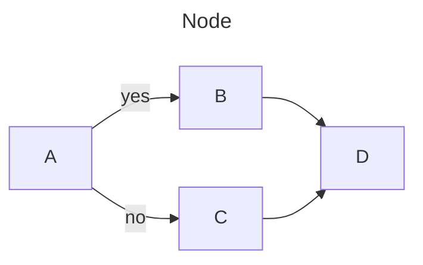

###### **目次**
```toc
style:nestedList
minLevel:2
maxLevel:5
```
# マークダウン書き方

主にhugo,obsidianにおいてマークダウンを書く上での基準。

## 基本

エスケープ記号 \\

箇条書き(点のみ)

- test1
- test2

箇条書き(数字)

1. test1
2. test2

**太字**
__太字__

*斜体*
_斜体_

~~打ち消し線~~

==ハイライト==

少なくともhackmdやobsidianでは**太字**はあまり目立たないので==ハイライト==のほうがいい。

## ファイルパス,コード

コードブロックを利用する。

ファイルパス \`で囲む
`/home/saku/Documents`

コマンド
文章中に入れる場合には\`で囲む
`sudo apt update`

ブロックとして囲む場合には\`\`\`で囲む。これならコピーができるので基本的にはコマンドはこっちを使う。
```bash
sudo apt update
```
\`\`\`の後に bash とか python とか書くと表示するソフトが対応していればいい感じに色つけたりしてくれる。なるべくしておきたい。とくにhugoは見やすさが割と変わる。

## 図表

多くは[Mermaid](https://mermaid.js.org)を使用する。Mermaidはobsidian,vscode,hugoで対応しているのでとりあえずは問題ない。

[vscodeの拡張機能](https://marketplace.visualstudio.com/items?itemName=bierner.markdown-mermaid)

各ソフトの対応状況
obsidian:プラグイン不要で標準対応
vscode::拡張機能をインストールするだけで使える。
hugo: 設定用のhtmlファイル作成と一部ファイルの編集が必要。

基本の形は↓
\``` mermaid
グラフの種類
表示内容
\...
\```

### フローチャート

[公式ドキュメント](https://mermaid.js.org/syntax/flowchart.html?id=flowcharts-basic-syntax)


Possible FlowChart orientations are:

TB - Top to bottom
TD - Top-down/ same as top to bottom
BT - Bottom to top
RL - Right to left
LR - Left to right

### 表

| TH | TH |
| ---- | ---- |
| TD | TD |
| TD | TD |

## スペース,改行

- 見出しの前後は必ず一行改行をはさむ。

## 画像

基本の書き方
```

```
obsidianはこれ↓でも可
```

```

サイズ変更
```

```

ただしobsidianではこれでかけないので以下のようにする。|横\*縦　横のみの指定で縦横比率を維持して拡大縮小する。
```

```

## 数式

MathJaxを使うことでObsidian上でLatex記法を使える。hugoなどでも同様。

インライン数式 \$で囲む  $f(x)=x^t + y$ 

ディスプレイ数式 \$$で囲む

$$f(x)=x^t + y$$

細かな書き方は[LaTeX]()へ。


## 参考

1.  [gihyo.jp編集部におけるMarkdown記法 | gihyo.jp](https://gihyo.jp/article/2022/08/gihyojp-markdown#gh4K578Zcq)
2. [Obsidian で数式を記述する LaTeX - Qiita](https://qiita.com/K-Fluid/items/c318b21448dfcbc2f960)
