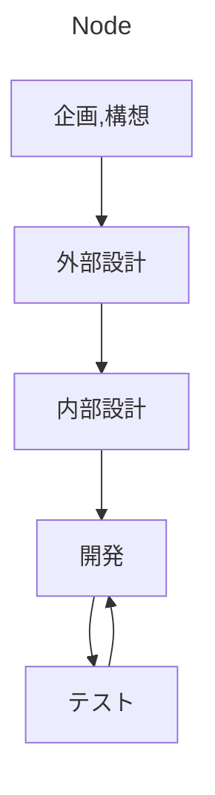

基本的に私のプログラミングは個人開発といえる。研究においても。

## 目的

大きく分けて

- 1 公開する(ソフト、webアプリ/サイト)
- 2 研究用
- 3 学習用

となる。重複することもある。ただし基本的に3はやりたくない。勉強のためだけに何かをやるのはやる気がでないしもったいない。

1,2は性質が異なるので以下でも適宜分けて考える。

## 流れ




### 企画,構想

何をやりたいか、どんなものを作るか考える。

研究の場合には自分の研究に必要なシミュレーションの場合が多いので割と単純に済む。

公開するソフトの個人開発などでは作りたいものを考えるときに自分だけでなく他の多くの人に必要であるか、使ってくれる人がいるかを考える。自分がいいものが他人にとってもいいものとは限らず誰も使わないソフトに価値はない。

### 設計

Chatgptと壁打ちしながら

Obsidianに要件定義書＋αのものを作る。それをもとにプロジェクトディレクトリにハードリンクを作成。

```bash
ln リンク元 ハードリンク
```

### 開発・テスト

テスト駆動開発である。

