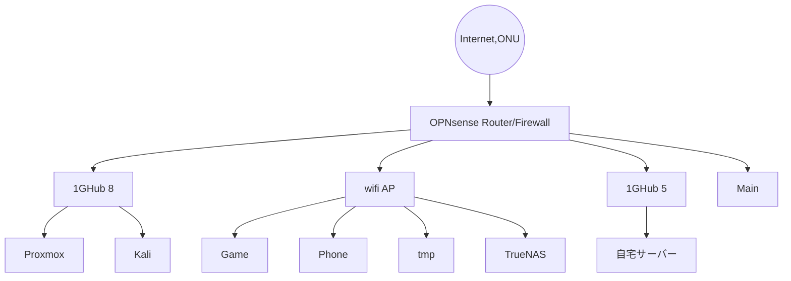

###### **目次**
```toc
style:nestedList
minLevel:2
maxLevel:5
```
# IPリスト

ネットワークマネージャー再起動

```bash
sudo systemctl restart NetworkManager
```

## 研究室

### 192.168.2

- 9:kajiki(saku打ちやすい)
- 10:OctoPrint(user:pi)
- 11:pelock(user:pelock)
- 81:Raspberrypi4-1
- 90:ubuntu server(specimen-tracker) 10:e7:c6:6f:02:27
- 99:TrueNAS
- 100:GPU server guppy(ssh port 42124) a8:a1:59:05:2d:56
- 201:My main PC

### その他

- 130.158.137.87:(port 8989-https://apwbd.ska.life.tsukuba.ac.jp/33zu/)

## アパート

### 192.168



1:OPT4 メインパソコン 絶対に守る 
2:OPT1 Kaliと仮想環境 攻撃されやすいがやられたらすぐに捨ててやり直す想定
3:OPT2 Wifiと適当なネット接続。攻撃されにくい。
4:OPT3 自宅サーバー

OPT1,2は隔離して他のサブネットとの通信遮断。OPT4はすべてのサブネットに通信可能、OPT1,2へはステートフルなので通信可能。

- 1.100:My main PC Kubuntu
- 2.100:proxmox
- 2.101:Kali
- 3.99: Switch2
- 3.100:TrueNAS
- 3.101:Huawei Wifi AP
- 4.100:Ubuntu server 自宅サーバー

## tailscale

- 100.103.25.99: My main PC Kubuntu
- 100.72.2.18: Google Cloud Engine
- 

## 参考

1. 