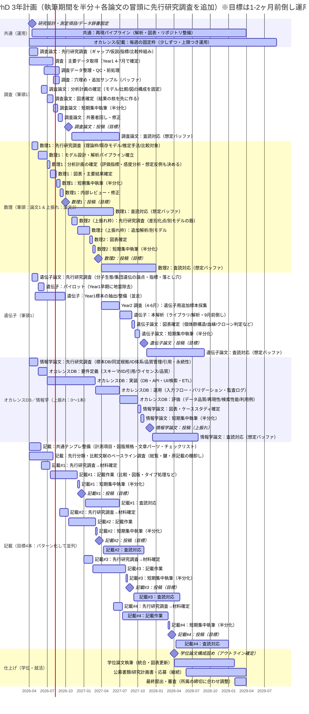

###### **目次**
```toc
style:nestedList
minLevel:2
maxLevel:5
```
# 博士計画

## 長期目標

論文を10本出す。記載論文は除く。


```mermaid
gantt
    title PhD 3年計画（執筆期間を半分＋各論文の冒頭に先行研究調査を追加）※目標は1-2ヶ月前倒し運用
    dateFormat  YYYY-MM-DD
    axisFormat  %Y-%m

    section 共通（運用）
    研究設計・測定項目/データ辞書固定                         :milestone, m_design, 2026-04-15, 1d
    共通：再現パイプライン（解析・図表・リポジトリ整備）         :active, repro, 2026-04-15, 2029-03-31
    オカレンス/記載：毎週の固定枠（少しずつ・上限つき運用）        :active, occ_taxo_block, 2026-04-01, 2029-08-31

    section 調査（筆頭1）
    調査論文：先行研究調査（ギャップ/仮説/指標/比較枠組み）        :active, field_lit, 2026-04-01, 2026-05-15
    調査：主要データ取得（Year1 4-7月で確定）                    :active, field_main, 2026-04-01, 2026-07-31
    調査データ整理・QC・前処理                                    :active, field_qc, 2026-06-15, 2026-08-31
    調査：穴埋め・追加サンプル（バッファ）                        :active, field_buffer, 2026-08-01, 2026-08-31

    調査論文：分析計画の確定（モデル/比較/図の構成を固定）          :active, field_plan_lock, 2026-06-01, 2026-06-30
    調査論文：図表確定（結果の核を先に作る）                      :active, field_fig, 2026-07-01, 2026-07-31
    調査論文：短期集中執筆（半分化）                              :active, field_write, 2026-08-01, 2026-08-23
    調査論文：共著者回し・修正                                    :active, field_coauthor, 2026-08-24, 2026-09-15
    調査論文：投稿（目標）                                        :milestone, m_field_submit, 2026-10-15, 1d
    調査論文：査読対応（想定バッファ）                            :active, field_review, 2026-11-01, 2027-06-30

    section 数理（筆頭：論文1 & 上振れ：論文2）
    数理1：先行研究調査（理論枠/既存モデル/推定手法/比較対象）       :active, math1_lit, 2026-04-15, 2026-05-15
    数理1：モデル設計・解析パイプライン確立                        :active, math1_pipe, 2026-05-16, 2026-06-30
    数理1：分析計画の確定（評価指標・感度分析・想定反例も決める）     :active, math1_plan_lock, 2026-07-01, 2026-07-15
    数理1：図表・主要結果確定                                      :active, math1_fig, 2026-07-16, 2026-08-15
    数理1：短期集中執筆（半分化）                                  :active, math1_write, 2026-08-16, 2026-09-03
    数理1：内部レビュー・修正                                      :active, math1_polish, 2026-09-04, 2026-09-20
    数理1：投稿（目標）                                            :milestone, m_math1_submit, 2026-10-01, 1d
    数理1：査読対応（想定バッファ）                                :active, math1_review, 2026-10-15, 2027-05-31

    数理2（上振れ枠）：先行研究調査（差別化点/別モデルの筋）          :active, math2_lit, 2026-11-01, 2026-11-30
    数理2（上振れ枠）：追加解析/別モデル                            :active, math2_work, 2026-12-01, 2027-01-31
    数理2：図表確定                                                :active, math2_fig, 2027-02-01, 2027-02-14
    数理2：短期集中執筆（半分化）                                  :active, math2_write, 2027-02-15, 2027-02-28
    数理2：投稿（目標）                                            :milestone, m_math2_submit, 2027-03-15, 1d
    数理2：査読対応（想定バッファ）                                :active, math2_review, 2027-04-01, 2027-12-31

    section 遺伝子（筆頭1）
    遺伝子論文：先行研究調査（分子生態/集団遺伝の論点・指標・落とし穴）:active, gen_lit, 2026-04-15, 2026-05-15
    遺伝子：パイロット（Year1早期に地雷除去）                      :active, gen_pilot, 2026-05-16, 2026-06-15
    遺伝子：Year1標本の抽出/整備（並走）                            :active, gen_y1_prep, 2026-05-01, 2026-09-30

    Year2 調査（4-6月）：遺伝子用追加標本採集                        :active, field_y2_for_gen, 2027-04-01, 2027-06-30
    遺伝子：本解析（ライブラリ/解析・9月前倒し）                     :active, gen_main, 2027-07-01, 2027-08-31
    遺伝子論文：図表確定（個体群構造/血縁/クローン判定など）          :active, gen_fig, 2027-09-01, 2027-09-15
    遺伝子論文：短期集中執筆（半分化）                               :active, gen_write, 2027-09-16, 2027-10-10
    遺伝子論文：投稿（目標）                                         :milestone, m_gen_submit, 2027-10-31, 1d
    遺伝子論文：査読対応（想定バッファ）                             :active, gen_review, 2027-11-15, 2028-08-31

    section オカレンスDB／情報学（上振れ：0〜1本）
    情報学論文：先行研究調査（標本DB/同定根拠/ID体系/品質管理/引用・永続性）:active, occ_lit, 2026-04-01, 2026-05-15
    オカレンスDB：要件定義（スキーマ/ID/引用/ライセンス/品質）          :active, occ_req, 2026-05-16, 2026-06-30
    オカレンスDB：実装（DB・API・UI/検索・ETL）                         :active, occ_build, 2026-07-01, 2027-02-28
    オカレンスDB：運用（入力フロー・バリデーション・監査ログ）           :active, occ_ops, 2027-03-01, 2027-06-30
    オカレンスDB：評価（データ品質/再現性/検索性能/利用例）               :active, occ_eval, 2027-07-01, 2027-09-30
    情報学論文：図表・ケーススタディ確定                               :active, occ_fig, 2027-10-01, 2027-10-15
    情報学論文：短期集中執筆（半分化）                                  :active, occ_write, 2027-10-16, 2027-10-31
    情報学論文：投稿（上振れ）                                          :milestone, m_occ_submit, 2027-11-30, 1d
    情報学論文：査読対応（想定バッファ）                                :active, occ_review, 2027-12-15, 2028-07-31

    section 記載（目標4本：パターン化して並列）
    記載：共通テンプレ整備（計測項目・図版規格・文章パーツ・チェックリスト） :active, taxo_template, 2026-04-01, 2026-05-31
    記載：先行分類・比較文献のベースライン調査（総覧・鍵・原記載の棚卸し）    :active, taxo_base_lit, 2026-04-01, 2026-07-31

    記載#1：先行研究調査→材料確定                                     :active, taxo1_lit, 2026-06-01, 2026-07-15
    記載#1：記載作業（比較・図版・タイプ処理など）                     :active, taxo1_work, 2026-07-16, 2026-11-30
    記載#1：短期集中執筆（半分化）                                     :active, taxo1_write, 2026-12-01, 2026-12-10
    記載#1：投稿（目標）                                               :milestone, m_taxo1_submit, 2026-12-20, 1d
    記載#1：査読対応                                                   :active, taxo1_rev, 2027-01-10, 2027-06-30

    記載#2：先行研究調査→材料確定                                     :active, taxo2_lit, 2026-09-01, 2026-10-15
    記載#2：記載作業                                                   :active, taxo2_work, 2026-10-16, 2027-03-01
    記載#2：短期集中執筆（半分化）                                     :active, taxo2_write, 2027-03-02, 2027-03-10
    記載#2：投稿（目標）                                               :milestone, m_taxo2_submit, 2027-03-20, 1d
    記載#2：査読対応                                                   :active, taxo2_rev, 2027-04-10, 2027-10-31

    記載#3：先行研究調査→材料確定                                     :active, taxo3_lit, 2027-01-01, 2027-02-15
    記載#3：記載作業                                                   :active, taxo3_work, 2027-02-16, 2027-08-01
    記載#3：短期集中執筆（半分化）                                     :active, taxo3_write, 2027-08-02, 2027-08-10
    記載#3：投稿（目標）                                               :milestone, m_taxo3_submit, 2027-08-20, 1d
    記載#3：査読対応                                                   :active, taxo3_rev, 2027-09-10, 2028-04-30

    記載#4：先行研究調査→材料確定                                     :active, taxo4_lit, 2027-06-01, 2027-07-15
    記載#4：記載作業                                                   :active, taxo4_work, 2027-07-16, 2028-03-01
    記載#4：短期集中執筆（半分化）                                     :active, taxo4_write, 2028-03-02, 2028-03-10
    記載#4：投稿（目標）                                               :milestone, m_taxo4_submit, 2028-03-20, 1d
    記載#4：査読対応                                                   :active, taxo4_rev, 2028-04-10, 2028-12-31

    section 仕上げ（学位・就活）
    学位論文構成固め（アウトライン確定）                               :milestone, m_thesis_outline, 2028-04-01, 1d
    学位論文執筆（統合・図表更新）                                     :active, thesis_write, 2028-04-02, 2029-01-31
    公募書類/研究計画書・応募（継続）                                  :active, job_apps, 2028-06-01, 2029-03-31
    最終提出・審査（所属の締切に合わせ調整）                           :active, thesis_finalize, 2029-02-01, 2029-03-31

```

## 参考

1. 